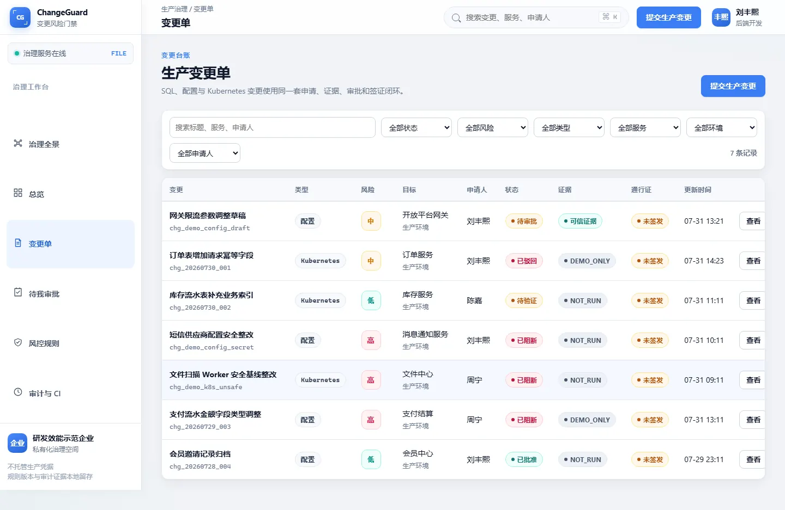
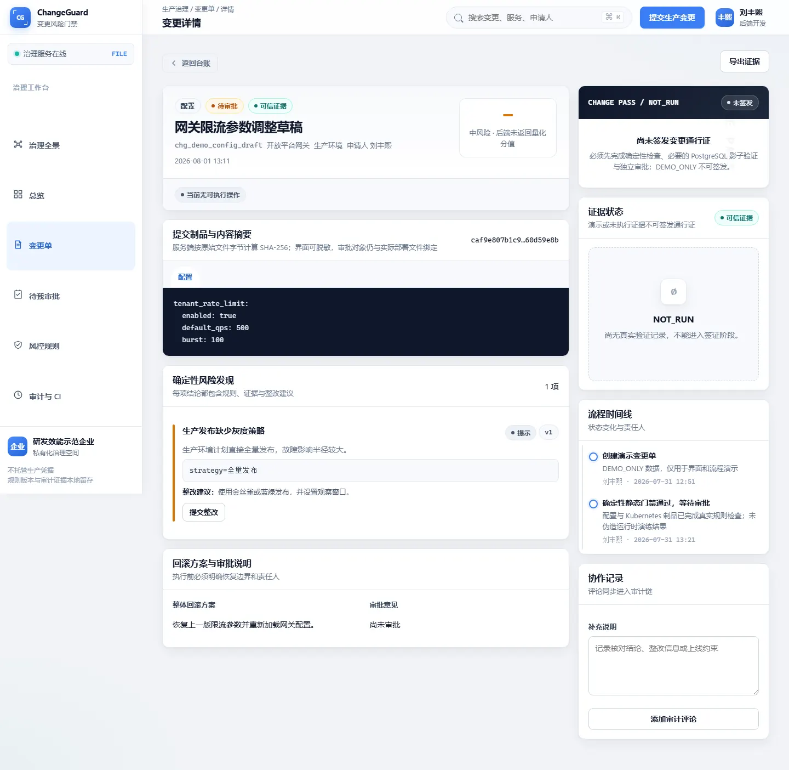

# ChangeGuard

SQL、配置和 Kubernetes 变更的检查与审批服务，用 Go 编写。

审批工单通过了，不代表流水线部署的还是那份文件。ChangeGuard 把检查结果和审批绑定到文件摘要，签发短时通行证；CI 在部署前从工作区重新读文件、计算摘要，再消费通行证。文件、环境或规则版本对不上，就停止。

它不执行生产 SQL，也不操作 Kubernetes 集群。部署仍由原来的 CI/CD 完成。

[运行演示](docs/demo-playbook.md) · [设计说明](docs/architecture.md) · [测试说明](docs/testing.md) · [CI 接入](docs/ci-integration.md)

## 工作流程

```text
提交文件 → 规则检查 → 独立审批 → 签发通行证 → CI 核对并消费
              │
              └─ SQL 还需在隔离 PostgreSQL 中验证迁移和回滚
```

| 制品 | 检查内容举例 |
| --- | --- |
| SQL | 无条件 UPDATE/DELETE、危险 DDL、缺少回滚、索引创建方式 |
| YAML / JSON / ENV 配置 | 明文凭据、生产 debug、关闭鉴权或 TLS 校验 |
| Kubernetes 清单 | latest、特权容器、hostPath、资源限制和健康探针 |

提交人不能审批自己的变更。修改文件或关键元数据后，需要重新检查和审批。

同一通行证只产生一次逻辑消费。原流水线丢失响应后可以用相同 consumer 重试，拿回首次结果；另一条流水线不能复用。`COMPLETED` 表示通行证已消费，**不表示部署成功**。具体重试约定见 [ADR 0001](docs/adr/0001-idempotent-passport-consume.md)。

## 本地运行

需要 Go 1.25 或更新版本。以下 PowerShell 命令使用文件存储和内存会话，无需安装数据库：

```powershell
git clone https://github.com/kyfd/changeguard.git
Set-Location changeguard
$env:CHANGEGUARD_AUTH_MODE = "local"
$env:CHANGEGUARD_ENABLE_DEMO_ACCOUNTS = "true"
$env:CHANGEGUARD_ENABLE_DEMO_DATA = "true"
$env:CHANGEGUARD_LISTEN_ADDRESS = "127.0.0.1:8080"
$env:CHANGEGUARD_PASSPORT_HMAC_SECRET = "changeguard-local-demo-secret-32-bytes-minimum"
go run ./cmd/dbguard
```

打开 [localhost:8080](http://localhost:8080)。本地数据保存在 `data/`，按 Ctrl+C 停止服务。

| 演示账号 | 用途 |
| --- | --- |
| developer@example.com | 创建、提交、整改 |
| reviewer@example.com | 审批、签发通行证 |
| owner@example.com | 管理服务、成员和规则，高风险审批 |

演示密码均为 `Demo1234`。上面的账号和 HMAC secret 只能用于本机演示，不能用于公网部署。未配置影子库时，SQL 只有静态检查结果，不能签发生产通行证。

需要真实 PostgreSQL、Redis 和 SQL 影子验证时：

```powershell
docker compose -p changeguard-demo -f compose.e2e.yml up --build --wait
```

打开 [localhost:18080](http://localhost:18080)。这是专用演示环境，包含预置数据。不要把它的数据库或账号接入生产。

## 界面

内嵌页面提供创建、检查、审批、通行证和审计操作，随 Go 服务一起启动。另有 [Vue 控制台](https://github.com/kyfd/changeguard-web)，页面能力和开发方式见该仓库说明。





## 接入流水线

构建 Gate CLI，并在清单中登记实际文件：

```powershell
go build -o changeguard-gate.exe ./cmd/changeguard-gate
.\changeguard-gate.exe digest -manifest .\examples\ci-demo\.changeguard.json
```

把 `CHANGEGUARD_URL` 和 `CHANGEGUARD_TOKEN` 放进 CI 受保护的环境变量，然后在部署前执行：

```text
changeguard-gate verify  -manifest .changeguard.json -consumer <pipeline-id>
changeguard-gate consume -manifest .changeguard.json -consumer <pipeline-id>
```

`consume` 必须紧邻部署步骤，任何非零退出码都应停止流水线。不要把 Token 放进仓库、命令参数或日志。[接入指南](docs/ci-integration.md)包含 GitLab 和 Jenkins 示例。

## 实现与测试

- PostgreSQL 消费事务同时保存通行证状态、变更状态和审计事件。
- SQL 验证任务通过 Outbox 领取，租约代次用于拒绝旧 worker 的结果提交。
- 审计事件按组织链接哈希，可以导出证据包离线检查。
- Redis 用于会话；本机演示可以不用它。

```powershell
go test ./...
go vet ./...
npm.cmd test
```

PG/Redis 集成测试、浏览器测试和并发场景的环境要求见[测试说明](docs/testing.md)。性能数据和测量口径见[性能记录](docs/benchmarks.md)，不作为生产 SLA。

## 已知边界

- 空库首次启动须由单实例完成迁移，再扩容其他实例；当前迁移没有跨进程互斥，不能同时初始化空库。演示 Compose 已按此顺序启动。

- 影子验证不是生产数据、锁竞争或性能验证。`CONCURRENTLY` 在影子事务中会被移除，生产 SQL 保持原样。
- PostgreSQL 核心表仍与 `dbguard_state` 兼容快照共同维护；部分路径会锁定这条快照，不能据此宣称多实例吞吐线性扩展。
- 哈希链用于应用级篡改检测，不是 WORM，也不能阻止数据库管理员删除整段数据。
- 可选模型分析只提供说明，不参与审批或放行。模型不可用不应阻止确定性检查。

完整安全边界见[威胁模型](docs/threat-model.md)。生产部署需要独立凭据、隔离影子库、HTTPS 和备份恢复方案，见[运维文档](docs/enterprise-operations.md)。

## 代码入口

```text
cmd/dbguard/              HTTP 服务
cmd/changeguard-gate/     CI 摘要、校验和消费
cmd/changeguard-evidence/  证据包导出和离线校验
internal/service/         状态迁移与权限
internal/store/           存储、事务、Outbox 与幂等
internal/httpapi/         HTTP 接口和内嵌页面
```

服务入口保留历史名称 `dbguard`；环境变量优先使用 `CHANGEGUARD_*`，旧的 `DBGUARD_*` 暂时兼容。

[文档索引](docs/README.md) · [贡献说明](CONTRIBUTING.md) · [变更记录](CHANGELOG.md) · [MIT License](LICENSE)
