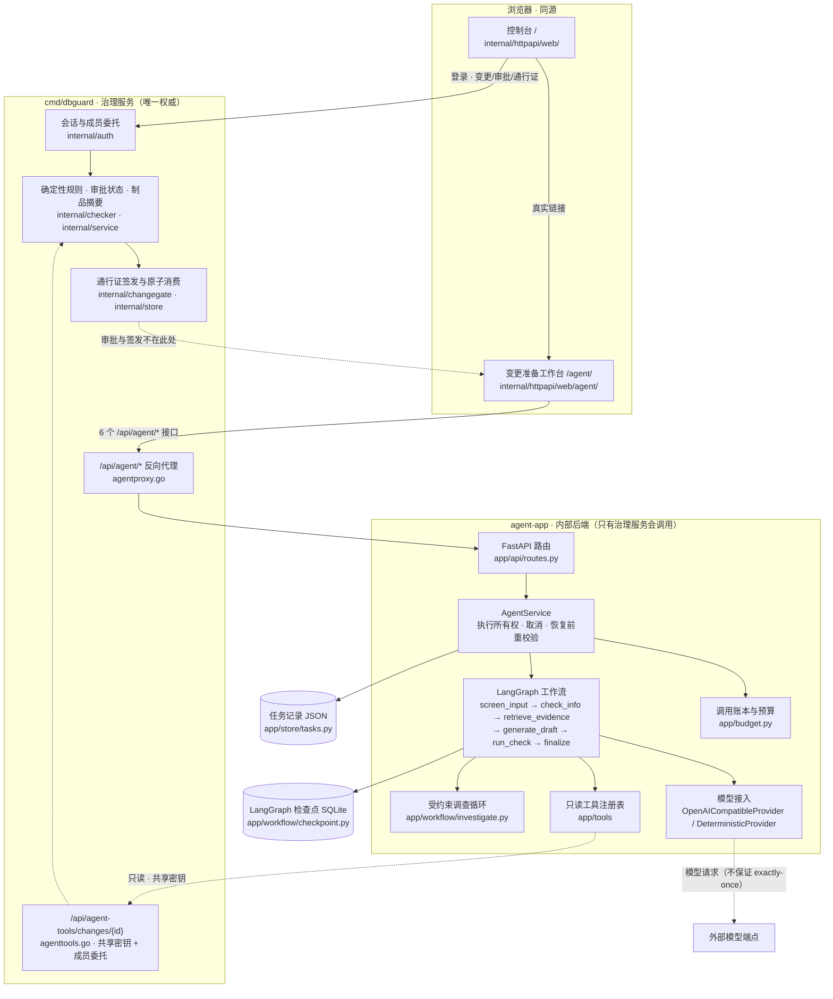

# 变更准备 Agent：运维边界、设计说明与面试交付

本文是 §7（部署与工程边界）与 §8（文档与面试交付）的落地材料。
**口径**：每条能力都指向仓库中的代码、测试或报告；未验证项显式标注，不把脚本评测说成真实模型结果。

---

## 1. 部署与工程边界（§7）

### 1.1 当前支持的部署形态：**单实例**

| 存储 | 位置 | 约束 |
| --- | --- | --- |
| 任务记录 | JSON 文件（`AGENT_TASK_STORE`，默认 `data/agent-tasks.json`） | 单写者：进程内 `TaskRepository` 用 `threading.Lock` 保护整文件读改写 |
| 图检查点 | SQLite 文件（`AGENT_CHECKPOINT_PATH`，默认与任务存储同目录） | 单实例：`AsyncSqliteSaver`，每次图调用开一条短连接 |
| 语料 | 目录（`AGENT_DEMO_DIR`） | 只读 |

**明确不支持**：多 worker / 多副本。原因不是"没做"，而是这两个存储都不是多写者安全的：

- JSON 仓储是**整文件替换**（写临时文件 + `os.replace`）。两个进程同时写会互相覆盖，表现为"刚提交的信息消失"。
- SQLite 检查点是**同一文件**上的多连接写。多副本下同一 `thread_id` 会被两个进程同时推进，
  检查点不是并发安全的共享可变状态——这与 #23 修掉的"同进程内并发恢复"是同一类问题，只是跨进程后无法用事件循环的原子性兜住。

### 1.2 防误用措施

1. **恢复前的重校验**（`AgentService.resume`）：组织 + 创建者、任务状态、执行代际、输入/材料版本，
   任一项不通过即 409；已有在途执行时直接拒绝。
2. **执行代际栅栏**：`execution_id` / `run_generation` 让被取代的执行无法回写。
3. **账本落盘钩子**：`_persist_ledger` 发现执行已被取代/取消时抛 `LedgerPersistError`，
   **停止**继续调用模型，避免多写者场景下产生无账目消耗。
4. **启动扫描**：进程启动时把上次遗留的在途任务显式标记（`checkpoint_available` /
   `interrupted_without_resume`），不自动续跑。

### 1.3 两个存储不一致时怎么识别与恢复

| 现象 | 含义 | 处置 |
| --- | --- | --- |
| 任务记录停在 `RUNNING`/`RECEIVED`，进程已重启 | 上次执行被中断 | 启动扫描标为失败；有检查点时标 `checkpoint_available`，由创建者显式恢复 |
| 有检查点但任务记录已 `CANCELLED` | 恢复被拒绝（状态守卫） | 无需处置；旧检查点不再被使用 |
| 任务记录已终态，但账本 `usage` 缺失 | 该执行异常退出，账目未落盘 | 视为"未知消耗"（不填 0）；`known=false` 会出现在视图里 |
| 终态落盘持续失败 | 存储不可用 | 健康检查报 `degraded` + `unpersisted_tasks`；`wait_for` 抛 `TaskStateUnavailable`，不返回过期视图 |

### 1.4 隔离演示启动（含 Go + Python Agent）

```powershell
# 1) Python Agent（内部后端，只有治理服务会调用它）
cd agent-app
$env:AGENT_ALLOW_HEADER_IDENTITY = "1"      # 身份由治理服务注入
$env:AGENT_UPSTREAM_TOKEN        = "demo-shared-secret"
$env:AGENT_TASK_STORE            = "$PWD/data/demo-tasks.json"
$env:AGENT_CHECKPOINT_PATH       = "$PWD/data/demo-checkpoints.sqlite"
$env:AGENT_DEMO_DIR              = "..\examples\agent-demo"
.\.venv\Scripts\python.exe -m uvicorn app.main:app --host 127.0.0.1 --port 18091

# 2) Go 治理服务（浏览器只与它通信；它反向代理 /api/agent/*）
$env:PORT                          = "18099"
$env:DBGUARD_DATA_FILE             = "$PWD\data\demo-dbguard.json"
$env:DBGUARD_ENABLE_DEMO_ACCOUNTS  = "true"
$env:DBGUARD_AGENT_BASE_URL        = "http://127.0.0.1:18091"
$env:DBGUARD_AGENT_UPSTREAM_TOKEN  = "demo-shared-secret"   # 必须与 Agent 侧一致
$env:DBGUARD_WORKERS               = "0"
.\bin\dbguard.exe

# 3) 浏览器：http://127.0.0.1:18099/ 用 developer@example.com / Demo1234 登录，再进 /agent/
```

**不连接生产库**：Agent 的表结构来自显式导入的快照；三个远程只读工具走
`/api/agent-tools/changes/{id}`（共享密钥 + 成员委托），不持有生产凭据。

### 1.5 备份、恢复与版本兼容

- **备份**：停止服务后复制 `AGENT_TASK_STORE` 与 `AGENT_CHECKPOINT_PATH` 两个文件即可（两者必须**同时**备份，
  否则会出现"有检查点但任务记录缺失"或反之）。
- **恢复**：把两个文件放回原路径再启动。启动扫描会把在途任务标为中断失败；可恢复的由创建者显式恢复。
- **版本兼容**：检查点库由 `AsyncSqliteSaver.setup()`（`CREATE TABLE IF NOT EXISTS`）创建，可重入；
  任务记录的 JSON 只做**加法**演进（新增字段有缺省），旧记录缺字段按失败关闭或按缺省处理。
  升级前建议先备份两个文件；降级需要回滚检查点库（新版本可能写入旧版本不认识的列）。
- **常见故障**：`TaskRepositoryCorrupted`（状态文件损坏）会让服务**启动失败**——这是有意的失败关闭，
  不要删除文件"让服务起来"，那等于丢任务；应先从备份恢复或人工检查。

---

## 2. 关键设计说明（§8.4）

### 2.1 为什么模型不能直接审批或执行

- **审批与放行的权威在 Go 治理服务**：静态规则、审批状态、制品摘要、通行证签发与原子消费都在 `internal/*`；
  Agent 只能**准备材料**。
- **模型输出是不可信数据**：提示注入会让"看起来正常"的输出携带越权意图，所以
  `parse_model_draft` 对未声明字段直接拒绝、`confirmed` 一律服务端决定、
  证据 ID 必须真实存在。
- **模型工具保持只读**：白名单与 `read_only=True` 双重拦截（`app/llm/provider.py` 的
  `MODEL_ACTION_TOOLS` 与注册表的一致性断言），模型无从执行 SQL、部署、回滚或签发通行证。
- **材料确认 ≠ 治理审批 ≠ 执行许可**：`Confirmation` 只记录"谁在什么时候确认了哪一版材料（内容哈希）"，
  不改变任务状态，也不授予任何执行权利。

### 2.2 为什么需要模型调查；什么时候固定工作流更合适

- 需要模型调查：需求形态不固定（缺什么信息、该查哪条规范、是否要补检索），
  固定脚本只能按写死的顺序检索，遇到"第一次检索没命中"时无法自行调整。
- 固定工作流更合适：输入规整、只要可复现的确定性回归；或**没有可用模型**时。
  这是默认策略（`investigation_strategy=fixed_workflow`），并且是**回退路径**，不是残缺状态。
- 决策者能力必须显式声明：`RulePlanner` 的报告里写 `planner=rule`，
  provider 不具备 `decide()` 时**显式报告不可用**，绝不把规则包装成"模型的选择"。
- **两者的价值差异尚未被对照评测证明**（见 §4）：目前只能说"模型能选"，不能说"模型更好"。

### 2.3 恢复、取消、并发与预算如何协同

| 机制 | 作用 |
| --- | --- |
| `thread_id = task_id` + 检查点 | 中断后从**节点**续跑，中断前的节点不重跑（`screen_input` 只出现一次即判据） |
| `interrupt()` | 缺信息时把图停在节点上，而不是走到 END |
| 执行代际（`execution_id`/`run_generation`） | 取消/重跑后旧协程无法回写 |
| 取消 | **先落盘后终止**；落盘失败返回 503 可重试，执行继续，不留孤儿 |
| 恢复前重校验 | 授权、状态、检查点待办、输入/材料版本；不通过即 409 |
| 输入变更 | `input_version` 变化 → 旧草案/检查结果失效；材料内容变化 → 旧确认失效 |
| 调用账本 | 按请求累计并**随每次调用落盘**；恢复/重试/重启**续算**，只有新建任务清零 |
| 预算 | `AGENT_MAX_TASK_REQUESTS` / `AGENT_MAX_TASK_TOKENS` / `..._PROMPT_TOKENS` / `AGENT_MAX_TASK_COST`；
发请求前检查，超限即停止；缺 usage 按保守值计入判定，缺定价时费用上限**失败关闭** |

### 2.4 单实例方案的边界与演进条件

演进到多实例的**触发条件**（满足其一即需要外部状态存储）：

1. 需要横向扩容（>1 副本）或滚动发布不中断任务；
2. 需要跨机恢复在途任务；
3. 任务量使整文件 JSON 重写成为瓶颈。

演进方向：任务仓储换 PostgreSQL（乐观并发 + 组织/应用隔离），检查点换共享后端
（`langgraph-checkpoint-postgres` 或等价的分布式实现），并把执行所有权升级为**带租约的分布式认领**。
在此之前，多副本部署必须被显式禁止（见 §1.1）。

---

## 3. 五分钟演示脚本（§8.5）

前置：按 §1.4 起两个进程，浏览器登录 `developer@example.com / Demo1234`。

| # | 操作 | 看点 |
| --- | --- | --- |
| 1 | **正常任务**：填完整槽位 + 粘贴订单表快照 → 开始准备 | 草案生成；右栏「执行轨迹与预算」显示**真实策略**、停止原因、工具观察与 token（未知即写 unknown）；「确定性检查」与「AI 风险建议」是两张不同的卡 |
| 2 | **缺证据追问**：只填需求（留空槽位）→ 提交 | 图停在**节点级中断**上等待补充（不是走到 END）；追问表单显示问题原文与示例；按钮是「从检查点恢复」 |
| 3 | **预算停止**：把 `AGENT_MAX_TASK_TOKENS` 调小后重启 Agent，再跑一次 | 任务在预算用尽处**停止**并给出原因；`usage` 标注已知/缺失，不把估算说成账单 |
| 4 | **中断恢复**：任务停在等待补充时**杀掉 Agent 进程**，重启后点「从检查点恢复」 | 从等待点继续；时间线里 `screen_input` 只出现一次（证明没有从头重跑）；跨进程证据见 `agent-app/scripts/recovery_acceptance.py` |
| 5 | **材料更新导致确认失效**：确认材料 → 用补充信息改变槽位触发重跑 | 旧确认被标为**已失效**（保留痕迹），需要重新确认；带旧材料哈希的确认会被服务端**拒绝并要求刷新** |

---

## 4. 简历/面试可引用事实清单（§8.6）

每条都指向仓库中的代码、测试或报告。**标注口径**：✅ 有确定性测试或真实进程证据；
⚠️ 仅脚本/合成数据；⬜ 未验证。

| # | 可引用事实 | 证据 | 口径 |
| --- | --- | --- | --- |
| 1 | 把 Agent 的任务读写授权下沉到**服务与仓储边界**，按组织 + 创建者隔离，跨组织读写与列表泄露在修复前是可复现缺陷 | `tests/test_authorization.py`（14 项）、`app/service.py::_authorize` | ✅ |
| 2 | 为执行引入**执行所有权**（`execution_id`/`run_generation`），取消与重跑能栅栏旧协程回写 | `tests/test_task_lifecycle.py`、`tests/test_execution_lifecycle.py`（27 + 14 项） | ✅ |
| 3 | 持久化**诚实性**：先落盘后提交内存、损坏状态失败关闭、终态落盘有上限重试并在用尽时报 `degraded` | 同上；`app/store/tasks.py`、`app/service.py::_persist_terminal` | ✅ |
| 4 | 用 **LangGraph 节点级 `interrupt()` + SQLite 检查点**实现"从等待点续跑"，并用 `screen_input` 只执行一次证明不是从头重跑 | `tests/test_checkpoint_resume.py`、`scripts/recovery_acceptance.py`（**真实跨进程** 13/13） | ✅ |
| 5 | 修掉一个**发布版本可复现的并发竞态**：恢复在检查点读取处有 await，期间取消会被恢复覆盖 | `tests/test_resume_concurrency.py`（改前 `ed4c964` 失败、改后通过） | ✅ |
| 6 | 让模型**真正选择只读工具**，同时用"白名单 == 注册表只读工具"的一致性断言阻止注册表新增写工具自动获得调用能力 | `tests/test_provider_action_decisions.py`（22 项）、`app/llm/provider.py::MODEL_ACTION_TOOLS` | ✅（假 HTTP 端点） |
| 7 | 建立**按请求/按任务**的调用账本：结构化记录、缺失即 unknown、并发任务不串账、恢复**续算**预算、账本落盘失败即停止调用 | `tests/test_usage_budget.py`（12 项）、`app/budget.py` | ✅ |
| 8 | 任务级硬上限：请求次数、轮次、工具调用、修订、总时限、token/prompt/费用（缺定价**失败关闭**） | `app/config.py`、`tests/test_usage_budget.py` | ✅ |
| 9 | 证据**适用性**校验：快照必须真的含目标表、规范适用范围必须覆盖目标库、unknown 状态不算有效 | `tests/test_bounded_investigation.py`（6 项新增）、`app/workflow/investigate.py::RequiredEvidence` | ✅ |
| 10 | 检查点**不能成为旁路**：恢复/补充对新增输入重跑注入筛查；确认需携带所见材料哈希 | `tests/test_resume_concurrency.py`、`tests/test_material_confirmation.py` | ✅ |
| 11 | 评测 `--provider`/`--strategy` **真正改变执行路径**，开发/保留集分离，报告含数据集哈希、逐例结果、请求数、P50/P95 与**未知项** | `agent-app/evals/run_eval.py`、`tests/test_eval_harness.py` | ✅（离线/脚本） |
| 12 | 修复了一个**既有跨实例一致性缺陷**：Postgres 通行证重放分支不刷新快照，导致并发消费中落败方一直显示 ACTIVE | PR #19（`802f59c`），由 CI `integration` 验证 | ✅（CI 证据） |
| 13 | 修复了**已知偶发**的 Go 启动恢复用例：1ms 租约 + 立即 checkpoint 在 `-race` 下必然偶发 `ErrConcurrentWrite`，改为可注入时钟的确定性过期 | PR #20（`161a84e`） | ✅ |
| 14 | 工作台把**四态**（模型建议 / 确定性检查 / 材料确认 / 治理审批）视觉区分，并显示存储降级与预算的已知/未知 | `internal/httpapi/web/agent/app.js` | ✅ 真实浏览器验收 **19/19**（本轮重跑，见 `docs/agent-upgrade-verification.md` §20.7 与 `docs/assets/agent-workbench-*.png`） |
| 15 | **fixed_workflow vs bounded_agent 的同输入对照评测（离线）** | `evals/run_eval.py --compare`（scripted provider）、`tests/test_eval_harness.py`；实测 `13/13` vs `14/14` | ⚠️ 离线已做且可复现，但只证明"策略参数真正改变执行路径"，**不证明模型调查带来提升**（scripted provider 不是真实模型） |
| 16 | **真实模型质量**（准确率、成本、延迟） | — | ⬜ **NOT_RUN**：无专用凭据与预算；离线评测是确定性回归，不是模型质量证明 |
| 17 | **多副本 / 分布式部署** | — | ⬜ 未支持（见 §1.1）；单实例是本轮的明确边界 |

**不能说**：多 Agent 协作、MCP、自进化 Prompt、长期用户画像、向量数据库、通用插件平台、
多副本调度，以及任何准确率/成本/延迟的提升数字。

---

## 5. 两个前端各自实现了什么（§6 收尾）

**口径**：页面能力以**实际代码**为准，不以"接口存在"或 README 为准。查不到服务端路由的面板
一律按**未完成**计，不写成"已实现但暂时没数据"。

先纠正一个称呼：`internal/httpapi/web/` 里的控制台**不是 Vue**——它对前端框架没有任何依赖
（`grep -i "vue\|createApp" internal/httpapi/web/**` 无命中），是手写的 ES Module 应用
（`index.html` → `ui-utils.mjs` → 动态 `import("./app.js")`）。`README.md` 另外引用了一个
**外部** Vue 控制台仓库，它不在本仓库内，本轮未做任何验证，也不计入下面的结论。

### 5.1 同源控制台（`/`，`internal/httpapi/web/`）

| 维度 | 事实 | 证据 |
| --- | --- | --- |
| 提供方式 | `cmd/dbguard` 的 catch-all 静态资源；`/agent/` 单独注册（否则会被 catch-all 落到控制台首页） | `internal/httpapi/server.go:132,138-156` |
| 视图 | 15 个导航项，按 5 种角色档案裁剪 | `web/app.js` `navItems`(35-55)、`workspaceProfiles`(86-129)、`renderPage`(400-433) |
| 已实现的操作 | 创建/编辑变更、提交规则检查、预发布验证、审批与驳回、签发通行证、风险项指派/解决/复核、评论、`agent-ask` 问答、导出变更报告(MD/XLSX)/规则 JSON/审计、规则增改与开关与试跑、服务配置、成员与邀请、CI 信任、升级上传/应用/中止、登录注册 | `web/app.js` 中对应的 `api("/api/...")` 调用点（4360 / 4415 / 3691 / 4458 / 4227 / 4182 / 1693 / 2177 / 3972 / 2444-2503 / 2805 / 2850-2887） |
| 实时刷新 | `EventSource /api/events`，变更详情另有轮询 | `web/app.js:3761,3655` |
| 与工作台的关系 | 侧边栏固定一条**真实链接** `/agent/`（刻意不带 `data-route`，不走前端路由）；**不读取** `prepare_agent_enabled`，因此 Agent 未配置时链接照样显示 | `web/app.js:385-388`；`internal/httpapi/server.go:305` |

**页面存在、但 `cmd/dbguard` 里没有对应路由的面板**（不得计入"控制台已完成"）：

| 面板 | 前端调用 | 服务端实情 |
| --- | --- | --- |
| 发布观测 · 结果信号 | `GET /api/changes/{id}/outcomes`（`app.js:1987`） | **无路由** |
| 事故回溯 | `GET /api/incidents/backtrace?symptom=…`（`app.js:2029`） | **无路由** |
| 集成设置 · CI 信任 | `GET/POST/PUT /api/ci/trusts*`（`app.js:2805-2808,2908`） | **无路由** |
| 集成设置 · 企业 LLM / 出站 | `/api/enterprise/llm*`、`/api/enterprise/outbound*`（`app.js:2938-2994,3310-3387`） | 只有 `/api/enterprise`、`/api/enterprise/members`、`/api/enterprise/invites`（`server.go:94-98`）；没有 llm/outbound。前端还要求 `capabilities.enterprise_api`，而 `handleConfigStatus` 从不返回 `capabilities`，因此这些控件**始终不可编辑** |
| 集成设置 · Agent 运行时 | `/api/agent-runtime/summary`、`/api/agent-runtime/events`（`app.js:2947,2951,3233`） | `cmd/dbguard` **无此路由**；只有另一个二进制 `cmd/changeguard-agent-gateway` 提供（`internal/agentgateway/gateway.go:89-91`）。单跑 `cmd/dbguard` 时该面板走的是失败分支 |
| 规则导出 | `GET /api/policies/export`（`app.js:2232`） | **无路由** |
| 影响图谱 2.0 | 明确**不发请求**，渲染静态占位文案 | `app.js:1964-1973`（"当前版本未提供逐变更影响图谱"） |

另有若干**未被 `index.html` 加载**的资产（`api-adapter.js`、`theme.js`、`stage3d.js`、
`lucide.min.js`、`frontier.css`、`luminous.css`）；`server_test.go:184-186` 还显式断言后两个样式表
不得被加载。

> 所以"控制台有 15 个导航项"**不等于**"这 15 个面板都能用"。上表这些面板只能按"未完成"引用。

### 5.2 Agent 工作台（`/agent/`，`internal/httpapi/web/agent/`）

| 维度 | 事实 | 证据 |
| --- | --- | --- |
| 提供方式 | 显式注册 `/agent/`，`handleAgentWorkbench` 提供静态资源；`/api/agent/*` 由 `handleAgentProxy` 反向代理，**仅在配置 `DBGUARD_AGENT_BASE_URL` 时启用**，否则 503 且 `code=SERVICE_UNAVAILABLE` | `agentproxy.go:62,72,99-159`；`server.go:1672` |
| 布局 | 单页三栏：对话 / 草案 / 证据与检查；顶栏显示身份与健康 | `agent/index.html`；`agent/app.js` `render`(482) |
| 已实现的操作 | 创建任务（296）；补充信息（337，含追问表单 `wireQuestionForm`(622)）；停止（355）；`resumeTask`(376) 在有检查点时是「从检查点恢复」、没有检查点时按钮是「重新执行一次」（后者是**重跑**，不是续跑，`app.js:560-565`）；人工确认材料（392，携带 `material_hash` 做乐观并发校验）；查看/复制 SQL 与回滚 | `agent/app.js` 上述行号 |
| 明确不做 | 治理审批与通行证签发、隔离库演练、执行 SQL；模型建议不参与放行判定 | `renderGovernanceBoundary`(967)、`renderShadowNotice`(1132)、`renderAdvice`(851)、`renderConfirmation`(871) |
| 只读边界 | 只调用 6 个 `/api/agent/*` 接口，不请求 `/provider`、`/tools`，不显示任何密钥 | 同上 |
| 降级判别 | 只有 503 **且** `code === "SERVICE_UNAVAILABLE"` 才判为"未启用"并禁用创建按钮；其余 503 按可重试错误处理 | `agent/app.js:265-270,419-424`、`markAgentDisabled`(281) |

**工作台自身的边界（如实记录）**：

- **单实例**：任务 JSON 与 SQLite 检查点都不支持多副本（§1.1）。
- 页面里的 SQL 编辑**只影响本地显示**，不回写服务端；一旦本地改过，检查结果与确认都会被标为
  对当前文本**已失效**（`app.js:729,1046`）。
- 工作台的能力由**真实浏览器验收**证明，不由 CI 的 `e2e` 作业证明——CI 的 `e2e` 栈用
  `compose.e2e.yml`，其中不含 agent-app（§1.4）。

---

## 6. 架构图

口径：这张图只画**代码里真实存在的部件与调用方向**，不画计划中的能力。虚线表示"只读、且不产生
放行判定"的通路；治理边界（审批、摘要、通行证签发与原子消费）**只在 Go 服务内**，Agent 侧没有节点。



图中三处与本文其余部分呼应，引用时不要拆开：

- `provider -.-> model` 是**唯一**的外部调用；它按次记账到 `app/budget.py`，但**不保证 exactly-once**
  （§2.3 的账本与恢复口径）。
- `agenttools -.-> gov` 是**只读**通路：共享密钥 + 成员委托，且不复用会话中间件。
- `passport -.-> workbench` 是**虚线**：工作台能看到治理边界的存在，但不能产生审批结论或执行许可。
