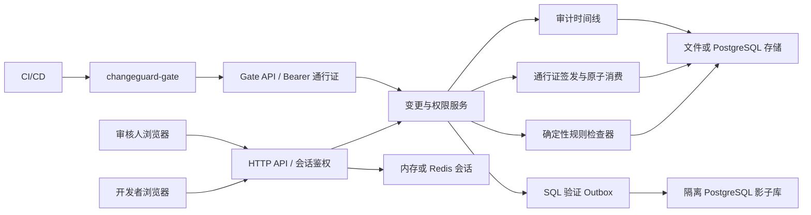
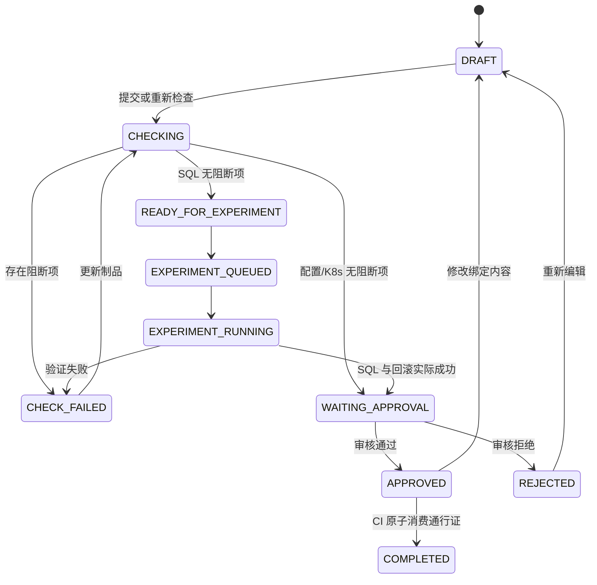

# ChangeGuard 系统架构

本文描述核心服务、CI Gate、SQL 影子验证和证据边界。仓库因兼容原因仍保留 `dbguard` 命名；可选模型分析不参与审批或通行证判定。

## 设计原则

1. **确定性优先**：相同制品和规则版本应产生相同检查结果。
2. **证据与结论对应**：静态检查、影子执行、人工审批和 CI 消费分别记录，不相互替代。
3. **失败关闭**：生产 Gate 超时、异常或绑定不一致时拒绝继续。
4. **最小集成**：复用现有 Git、CI/CD 和部署工具。
5. **职责分离**：提交人不能自审；组织管理权限不自动取得应用审核权限。
6. **敏感信息最小化**：通行证只存摘要，制品只保留检查和审阅所需内容。

## 逻辑架构

## 组件职责

### 内置前端

提供变更创建、检查结果、整改、审批、通行证状态和审计时间线。所有授权和状态迁移由服务端执行。

### HTTP API 与认证

- 浏览器接口支持本地认证和 OIDC，并对写操作校验会话与 CSRF；
- CI Gate 使用独立 Bearer 通行证，不复用浏览器会话；
- 服务端限制请求体大小，设置安全响应头，并避免在日志中记录凭据和制品正文；
- 每次读写都校验组织和应用授权。

### 变更与权限服务

服务层负责状态迁移、规则批次、发现项、审批、通行证和审计。关键状态变化与对应审计记录必须保持一致；提交人自审、跨组织读取和越权应用操作在服务端拒绝。

### 确定性检查器

支持 `DATABASE`、`CONFIG` 和 `KUBERNETES`。结果包含稳定规则编号、级别、阻断标记、命中位置、证据片段和整改建议。检查器不生成没有测量来源的锁等待、扫描行数、耗时或 P99。

### SQL 影子验证

SQL 在静态检查通过后进入 Outbox。一次业务尝试由稳定的 `attempt_id` 标识；每次领取递增 `lease_generation`，作为 fencing token。续租、失败、完成和最终写入必须匹配 worker、generation 和有效租约，过期 worker 不能覆盖接管后的结果。

执行边界为 `PREPARE → APPLY → FINALIZE`。当前 APPLY 在新的隔离 PostgreSQL 事务中执行完整迁移与回滚，不提供语句级 checkpoint。并发索引语句会去掉 `CONCURRENTLY`，以事务内等价形式执行；生产 SQL 保持原样。进程中断或租约过期后，新 generation 从头执行。FINALIZE 原子核对 `input_sha256` 和 `result_digest`；相同 attempt 和结果可幂等重试，摘要不一致时失败关闭。

只有 `POSTGRES` 模式下迁移和回滚都完成影子执行，SQL 才能进入待审批。`DEMO_ONLY`、`NOT_RUN` 和历史模拟结果不能用于签发生产通行证。

### 通行证

通行证绑定组织、变更、环境、规则版本和制品聚合摘要，并通过不可变变更记录关联应用和审批信息。原始 Token 只返回一次，持久化层保存 SHA-256。消费通过文件存储写锁或 PostgreSQL 条件更新完成，成功后通行证变为 `CONSUMED`，变更变为 `COMPLETED`。

### 存储与会话

本地模式使用文件存储和内存会话。部署模式可使用 PostgreSQL 和 Redis。

PostgreSQL 已包含 `changeguard_changes`、`changeguard_outbox`、`changeguard_passports`、`changeguard_audit_events` 和 `changeguard_idempotency_records`。Outbox 领取使用 `FOR UPDATE SKIP LOCKED`，通行证消费使用条件更新，审计链按组织通过事务 advisory lock 串行追加。

`dbguard_state` 仍保留 legacy JSONB，组织、成员、应用、规则及部分集成数据仍依赖该状态。核心表目前是兼容投影，不能在迁移完成前单独视为全部权威数据或删除 legacy state。

### 审计与证据包

`AuditEvent` 记录请求、主体、资源版本、请求摘要、结果、原因和关联事件。新事件按组织链接前序哈希；旧事件可以位于无哈希历史前缀，但新链开始后的空哈希会被离线校验拒绝。

`changeguard-evidence export` 从只读快照导出制品摘要、规则结果、影子验证、审批、通行证公开元数据、CI 结果和审计链证明。`verify` 可离线核对 manifest、变更绑定和审计链。证据包不包含制品或 SQL 正文、明文 Token 和 Token 摘要。

SHA-256 审计链只能发现应用数据被改写，不能替代外部 WORM、透明日志、可信时间戳或第三方签名。

## 状态机

核心约束：

- 制品、环境、应用或规则版本变化会使旧审批和通行证失效；
- `CHECK_FAILED` 不能批准；
- 提交人不能批准自己的变更；
- `COMPLETED` 不能再次签发或消费通行证；
- 配置和 Kubernetes 只产生静态检查证据；
- SQL 必须经过真实影子执行才能进入待审批。

## 证据含义

| 证据 | 可以证明 | 不能证明 |
| --- | --- | --- |
| 制品 SHA-256 | CI 文件是否与审批绑定内容一致 | 内容一定安全 |
| 规则发现项 | 是否命中当前规则覆盖的文本风险 | 生产性能和业务正确性 |
| PostgreSQL 影子执行 | 脚本与回滚在该隔离数据库中可执行 | 生产数据分布、负载和锁行为等价 |
| 人工审批 | 指定授权人员批准当前版本 | 发布不会发生事故 |
| 通行证消费 | 当前绑定通过一次性 Gate | 后续部署成功或服务健康 |
| 审计事件 | ChangeGuard 记录的操作和状态变化 | 外部系统中未回传的事实 |

## 信任边界

- ChangeGuard 不执行生产 SQL，不连接生产 Kubernetes 控制面；
- 影子库必须使用独立实例、凭据和网络边界；仅比较 DSN host:port 不能识别所有误配置；
- 浏览器会话和 CI 通行证是不同凭据，生命周期和权限分离；
- OIDC 校验 issuer、audience、state、nonce 和 PKCE；
- CI 必须保证计算摘要和实际部署使用同一工作区文件；
- 可选模型分析只有只读工具，不能审批、签发、消费或修改状态。

## 部署形态

最小本地演示使用单个 Go 进程、文件存储和内存会话。Compose 或受控部署可以使用 PostgreSQL、Redis 和独立影子库。多实例部署要求共享会话、数据库级原子消费、可验证的状态迁移以及经过演练的备份恢复；具体要求见[部署与运维](enterprise-operations.md)。
