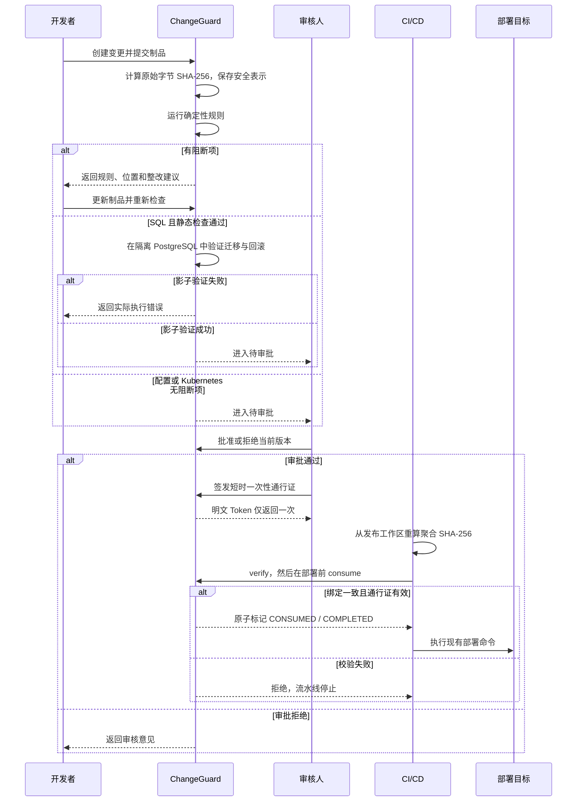

# ChangeGuard 业务流程

## 参与者

| 参与者 | 职责 |
| --- | --- |
| 开发者 | 创建、编辑和提交有权访问的应用变更，处理发现项 |
| 审核人 | 查看当前版本的制品和证据，批准、拒绝或要求整改 |
| 负责人 | 管理组织、成员、应用、规则和审核授权 |
| CI/CD | 从实际文件计算摘要，验证并消费指定通行证 |

提交人与审核人必须分离。组织管理权限不会自动绕过应用授权。

## 主流程

## 创建变更

变更至少包括：

- 应用、目标环境和计划时间；
- 仓库、分支和 commit 等来源信息；
- 一个或多个 `DATABASE`、`CONFIG`、`KUBERNETES` 制品；
- 目的、影响范围、发布策略和回滚方案。

服务端为每个制品计算摘要，并计算整张变更的聚合摘要。摘要基于脱敏前原始字节；持久化和展示内容执行脱敏。ChangeGuard 不是密钥存储，疑似凭据不应作为普通变更正文长期保存。

## 检查与 SQL 验证

每次提交或更新都产生与变更版本、规则版本和制品摘要绑定的检查批次。发现项包含规则编号、级别、命中位置、证据和整改建议。

阻断项未解决时不能审批。未命中规则只表示当前规则集没有发现已知模式，不表示生产验证通过。

SQL 静态检查通过后进入 Outbox，并在隔离 PostgreSQL 事务中验证迁移与回滚。并发索引语句会去掉 `CONCURRENTLY`，以事务内等价形式执行；生产 SQL 保持原样。只有迁移和回滚都完成影子执行才进入待审批。配置和 Kubernetes 不经过影子执行，也不生成运行时通过结果。

## 审批

审核人核对：

1. 当前检查批次是否仍有阻断项；
2. SQL 是否具备真实影子执行证据；
3. 业务影响、发布窗口、观察指标和回滚方案；
4. 当前制品摘要是否对应最后提交版本。

以下变化会使已有审批和未消费通行证失效：

- 制品内容、顺序或参与摘要的元数据变化；
- 应用、环境、commit 或发布策略变化；
- 规则版本变化并产生新的阻断项；
- 审核授权被撤销或成员停用。

## 通行证与 CI

只有实际审批人可以为已批准版本签发通行证。通行证绑定组织、变更、环境、规则版本、审批信息和制品摘要，默认有效期 10 分钟且只能消费一次。

CI 应先执行只读 `verify`，再在生产部署命令前执行 `consume`。任何非零退出码、超时或网络错误都必须停止部署。消费成功后旧 Token 不得用于发布重试；如果后续部署失败，应记录流水线结果并重新走变更与审批流程。

## 异常处理

| 场景 | 行为 |
| --- | --- |
| 阻断规则命中 | 保持 `CHECK_FAILED`，更新制品后重检 |
| SQL 影子验证失败 | 记录实际错误，不进入待审批 |
| 审核拒绝 | 记录意见，进入 `REJECTED` |
| 审批后修改绑定内容 | 撤销旧审批和未消费通行证 |
| 通行证过期或吊销 | Gate 拒绝，流水线停止 |
| 摘要或环境不匹配 | Gate 拒绝且不消费 Token |
| 并发消费 | 只有一个请求成功 |
| Gate 不可用 | 流水线失败关闭 |
| 消费后部署失败 | 保留 Gate 消费事实，另行记录流水线和运维结果 |

## 审计记录

至少记录创建、编辑、提交、检查、发现项变化、评论、批准、拒绝、通行证签发、验证、消费、过期和吊销。GitLab/Jenkins 流水线终态以及外部事故、回滚和业务 SLI 事件作为独立证据追加，不反向修改审批或 Gate 事实。

报告不得根据模板推断“部署成功”“已恢复”或“性能稳定”。没有外部事件或指标样本时，应明确标记为不可观测。
